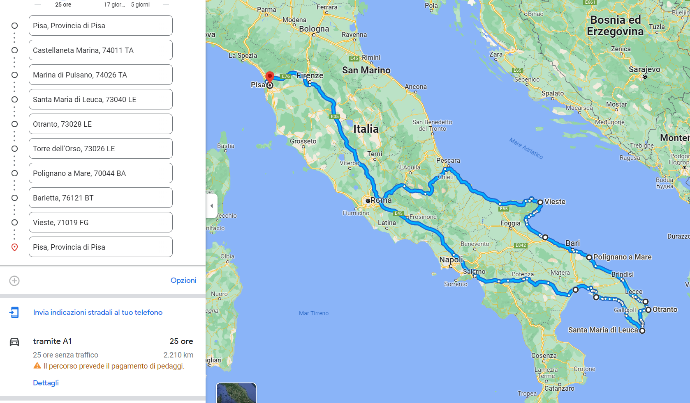

# Viaggio in Puglia
14-20 agosto (6 notti) 

## Giornata 1 (14 agosto)
Partenza da Pisa, notte a Vieste 

### Pernottamenti

#### Airbnb
[Manfredonia, 8 posti, 122€](https://www.airbnb.it/rooms/928089959071139091?adults=6&check_in=2023-08-14&check_out=2023-08-15&source_impression_id=p3_1688727380_GZcdPkk7ktWUTkbt&previous_page_section_name=1000&federated_search_id=a4b53b03-c5ba-4163-89a9-dfe16ff83e95)
[Peschici, 6 posti, 144€ (attendibilità dubbia)](https://www.airbnb.it/rooms/927575596025789445?adults=6&check_in=2023-08-14&check_out=2023-08-15&source_impression_id=p3_1688727319_m5GpuTD3wBDQwyi8&previous_page_section_name=1000&federated_search_id=a4b53b03-c5ba-4163-89a9-dfe16ff83e95)
[San Severo, 6 posti, 190€](https://www.airbnb.it/rooms/29140880?adults=6&location=vieste&check_in=2023-08-14&check_out=2023-08-15&source_impression_id=p3_1688727666_9VPWswxFKvzioyGz&previous_page_section_name=1001&federated_search_id=fc6aa01a-e787-4fa6-b015-552b66297d61)

#### Park4Night 
Sono disponibii decine di posti disponibili, anche gratuiti. \
**Per info, vedere park4night-gargano.png**. 

## Giornata 2 (15 agosto)
Giornata di mare nel gargano\
Raggiungere i nostri fratelli barlettani per serata & notte 

## Giornata 3 (16 agosto)
Giornata di mare a Polignano \
Notte a Lecce 

## Giornata 4 (17 agosto)
Giornata di mare a Torre dell'Orso \
Rientro a Lecce mid pomeriggio\
Serata a Gallipoli o similari \
Notte a Lecce 

## Giornata 5 (18 agosto)
Mare a Marina di Pulsano o Punta Prosciutto \
Notte a Castellaneta 

## Giornata 6 (19 agosto)
Mattinata di mare a Castellaneta nel chilling \
Notte a Campobasso 

## Giornata 7 (20 agosto)
Ritorno a Pisa 

